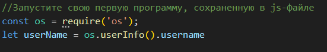
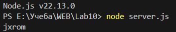
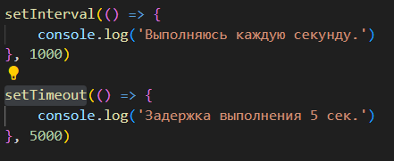
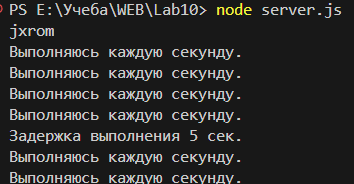
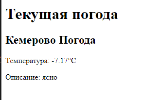

# Тестовый отчет через README

## Основные функции

### `Тестовый запуск сервера`


Пример использования.

### `setInterval`
Функция `setInterval` используется для выполнения заданного блока кода через определенные промежутки времени. Интервал задается в миллисекундах.

```javascript
setInterval(() => {
    console.log('Выполняюсь каждую секунду.')
}, 1000)
```
Этот код будет выводить текущее время в консоли каждую секунду.

### `setTimeout`
Функция setTimeout выполняет заданный блок кода после указанной задержки.
```javascript
setTimeout(() => {
    console.log('Задержка выполнения 5 сек.')
}, 5000)
Этот код выведет сообщение в консоль через 5 секунд.
```
Рекурсивный вызов с setTimeout
Для симуляции анимации можно использовать рекурсивный вызов функции с setTimeout.
```javascript
function animate() {
 console.log('Анимация...');
 setTimeout(animate, 1000); // Задержка в 1 секунду перед следующим вызовом
}
```




### `Погода в Кемерово через API`

```javascript
function fetchWeatherData() {
  return fetch('http://api.openweathermap.org/data/2.5/weather?q=Кемерово&appid=API_KEY&units=metric&lang=ru').then(response => {
    if (!response.ok) {
      throw new Error('Network response was not ok ' + response.statusText);
    }
    return response.json();
  });
}

function updateWeatherInfo(weatherData) {
  const weatherElement = document.getElementById('weather-data');
  weatherElement.innerHTML = `
  <h2>${weatherData.name} Погода</h2>
  <p>Температура: ${weatherData.main.temp}°C</p>
  <p>Описание: ${weatherData.weather[0].description}</p>
  `;
}

fetchWeatherData().then(data => updateWeatherInfo(data));
```

